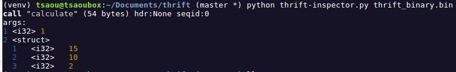

# Description

Parse Thrift Message blobs without knowing their `.thrift` definition. Inspired by [protobuf-inspector](https://github.com/jmendeth/protobuf-inspector). Powered by [thrift-tools](https://github.com/pinterest/thrift-tools).  

A plain run will just dump it / make a JSON  or Throw an Exception if it's of wrong format, intended to only show if it actually is a valid Thrift message or not. Proceed with thrift-tools to use the dict programmaticaly...


# Installation

```bash
$ git clone https://github.com/LAripping/thrift-inspector &&  cd thrift-inspector
$ virtualenv venv && source venv/bin/activate
$ pip install -r requirements.txt
```


# Usage

```bash
$ python thrift-inspector.py --help
usage: thrift-inspector.py [-h] [-d] [-c] [--json] [infile]

Deserialize Thrift payloads. Only TBinary currently supported

positional arguments:
  infile         read thrift message from binary file (omit for stdin)

optional arguments:
  -h, --help     show this help message and exit
  -d, --debug    more verbose output
  -c, --nocolor  turnoff color output
  --json         json output, no colors


$ python thrift-inspector.py thrift_binary.bin --debug --json
Found Thrift Message at index:0
{
  "args": {
    "fields": [
      {
        "field_type": "i32", 
        "field_id": 1, 
        "value": 1
      }, 
      {
        "field_type": "struct", 
        "field_id": 2, 
        "value": {
          "fields": [
            {
              "field_type": "i32", 
              "field_id": 1, 
              "value": 15
            }, 
            {
              "field_type": "i32", 
              "field_id": 2, 
              "value": 10
            }, 
            {
              "field_type": "i32", 
              "field_id": 3, 
              "value": 2
            }
          ]
        }
      }
    ]
  }, 
  "header": null, 
  "length": 54, 
  "seqid": 0, 
  "type": "call", 
  "method": "calculate"
}

$ cat thrift_binary.bin | python thrift-inspector.py --json  #also from stdin to head/tail/awk... before inspecting
{
  "args": {
    "fields": [
      {
        "field_type": "i32", 
...
```


## Extras

This tools does the following except just `print ThriftMessage.read( infile )`:

- Brute-force the start of the file (could be mixed format with some proprietary rules)

  > This is most often seen in the wild. eg: Not just a Thrift but a byte for the version then 2 appended Thrifts => Not valid as single Thrift message 

- Prints the decoded message in a colored, gist-only, eye-catching format descriptive **or** a machine-friendly Json 

